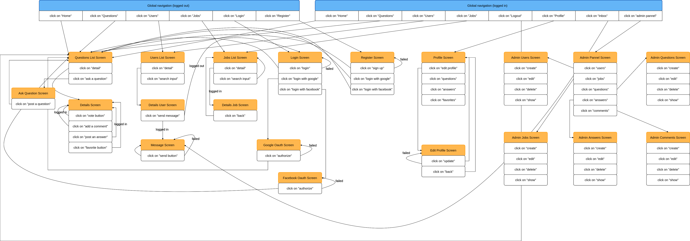

# README

## Development Language

- Ruby 2.6.5
- Rails 5.2.5

Things you may want to cover:

## Employmemnt Term Technology

- Devise
- Fonction de message
- Ajax
- Jquery
- Bootstrap
- Admin_rails
- Omniauth

## Technologies outside the curriculum

- Cloudinary

## Execution Procedure

```bash
$ git clone https://github.com/chaldrak/original_application_learnBetter.git
$ cd original_application_learnBetter
$ bundle install
$ rails db:create
$ rails db:migrate
$ rails db:seed
$ rails s
```

## Catalog Design

https://docs.google.com/spreadsheets/d/1xPwKEkZSETesFEWVWGbILhBwp4RjoNHi6-ZSRECEbws/edit?usp=sharing

## Table Definition Document

https://docs.google.com/spreadsheets/d/1WRSTKe2oj-3KR2zvTcRcneWVEwrxxSsqftKNM75aX1E/edit?usp=sharing

## ER Diagram


https://cacoo.com/diagrams/lzlue45crujyRN4e/AF7F7

## Screen Transition Diagram



https://cacoo.com/diagrams/UjI5dDG5l0YM9rP1/D9787

## Wireframes

https://cacoo.com/diagrams/WTwhAES2jQSvibMb/AC775